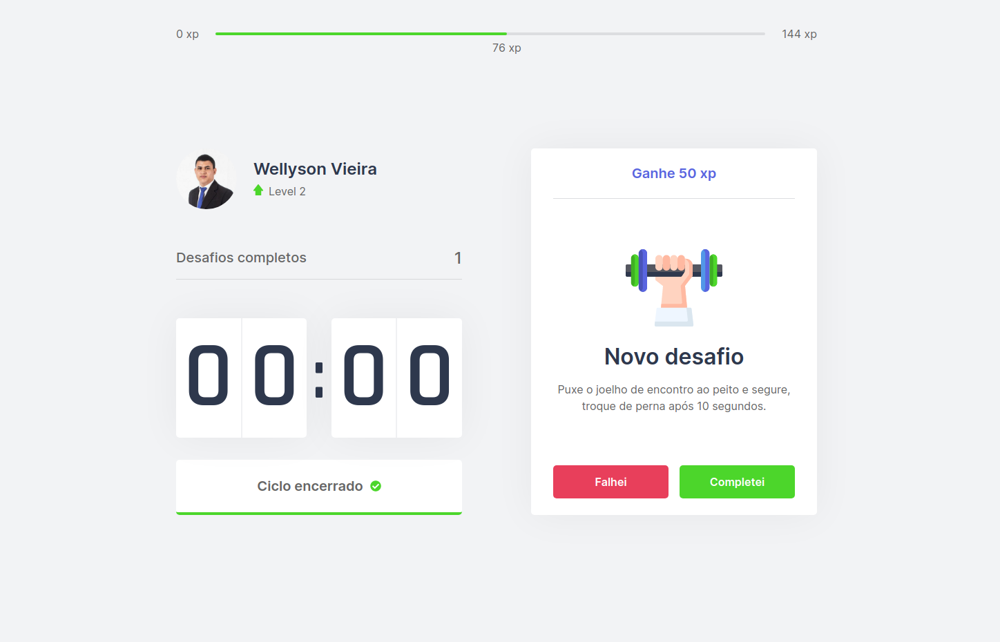

# move.it

Projeto desenvolvido na trilha de ReactJS da NLW#4 - RocketSeat

Consiste em um contador de tempo com intervalos de 25 minutos, que no fim de cada intervalo é proposto um desafio aleatório,
que envolve exércicios para os olhos ou corpo, e ao completar o desafio, o usuário ganha pontos de experiência e pode subir de nível.

Link: https://moveit-steel-eight.vercel.app

  

## ✨ Tecnologias

- HTML5/CSS3
- ReactJS
- Next.js

## 🚀 Como executar

- Clone o repositório
- Instale as dependências com `yarn`
- Inicie o servidor com `yarn dev`

Agora você pode acessar [`localhost:3000`](http://localhost:3000) do seu navegador.
